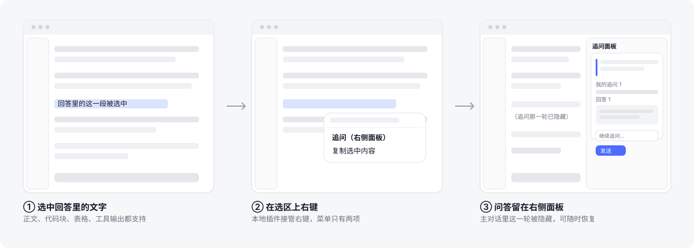
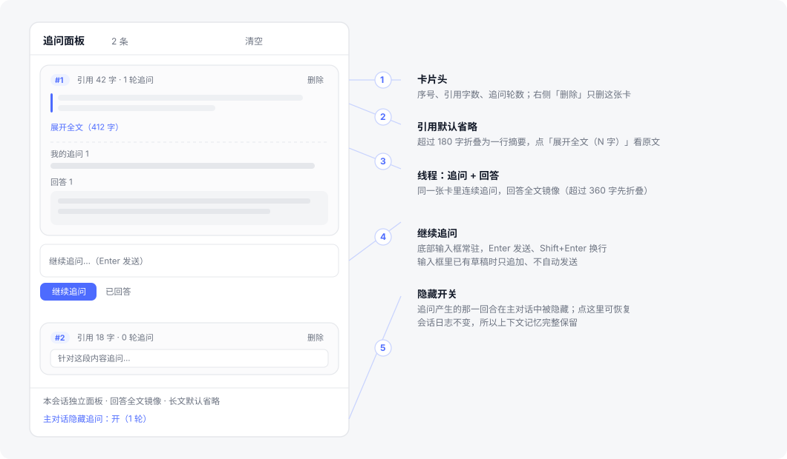

# dsh-plugin-followup（划词追问）

在 DeepSeek Harness Web 界面里，**选中助手回答中的任意文字 → 右键 → 追问**。
追问的问答留在**右侧面板**里，主对话里对应的那一轮会被隐藏——解决"追问之后想看回上一段回答要翻很久"的痛点。

纯客户端插件（浏览器半区），不需要宿主侧服务。

## 演示

**三步流程：选中 → 右键 → 问答留在右侧**



**追问面板结构**



> 以上是按实际 UI 结构绘制的矢量示意图（`docs/flow.svg`、`docs/panel.svg`），矢量图在任何缩放和深色背景阅读器下都清晰。
> 如果你想换成真实截图：把图片放进 `docs/`，再把上面两行改成对应文件名即可。

## 功能

| 能力 | 说明 |
| --- | --- |
| 划词追问 | 在已完成的回答里选中文字 → 右键 → `追问（右侧面板）`；正文、代码块、表格、工具块都支持 |
| 右侧面板 | 面板住在**原生右栏**（接管 `sidebar.right.tab.guide`），宽度与比例由产品自己计算，不会盖住主对话 |
| 按会话独立 | 追问卡片挂在 `sessionId` 上，每个工作区/会话各自一份 |
| 卡片线程 | 每张卡片是一条线程：`引用 → 追问1/回答1 → 追问2/回答2 …`，底部输入框常驻，可继续追问 |
| 回答全文镜像 | 回答从 `turn-tail` 节点的 `closing.blocks` 读取（应用"复制"按钮同源），**不截断** |
| 省空间的展示 | 引用/追问/回答默认省略（180 / 200 / 360 字），可一键「展开全文（N 字）」 |
| 主对话隐藏 | 追问产生的那一回合按 `data-chat-turn` 在**渲染层**隐藏；会话日志不变，因此模型上下文完整保留 |
| 常驻入口 | 会话头部 `追问 N` 按钮，随时开关面板 |
| 可恢复 | 面板底部开关可把隐藏的回合放回主对话；「清空」为二次确认，并一并恢复 |

## 安装

插件包结构遵循 harness 的 Web 插件表约定：

```
dsh-plugin-followup/
├── package.json        # dsh.client / dsh.bundle.patch 声明
├── cordis.patch.yml    # 组合补丁：把插件插进 composition
├── dist/
│   ├── client.cjs      # 浏览器半区（自包含，__ModuleLoader__ 契约）
│   └── index.js        # 宿主半区占位（本插件不需要宿主逻辑）
├── README.md
└── LICENSE
```

`dist/client.cjs` 的外层契约：

```js
window.__ModuleLoader__.load({
  id: `dsh-plugin-followup`,
  factory: (require) => {
    const React = require(`react`)
    const module = { exports: {} }
    module.exports.name = `dsh-plugin-followup`
    module.exports.inject = [`slots`, `timer`]
    module.exports.apply = (ctx) => { /* 注册右键菜单、面板、镜像 */ }
    return module.exports
  },
})
```

安装到 DSH profile（把包目录放进 profile 的 `node_modules`，或用 npm 从本仓库安装），然后重启 DSH：

```bash
# 例子：装进某个 profile
cd <profile-dir>
npm install github:<your-account>/dsh-plugin-followup
```

> ⚠️ 如果你同时在用**动态 Cordis 插件**版本（同一个会话里 `cordis_run` 起来的那份），请只留一个，否则会出现两个追问入口。

## 用法

1. 在任意一条**已说完**的回答里选中文字
2. 右键 → `追问（右侧面板）`
3. 右侧出现卡片：顶部是引用，中间是线程，底部输入框
4. 写问题 → `Enter` 发送（`Shift+Enter` 换行）
5. 回答全文流入卡片；主对话里这一轮被隐藏
6. 想对照原文时，点面板底部 `主对话隐藏追问：开/关`；「清空」会把隐藏的回合一并恢复

## 实现要点（都经过对运行时源码的核对）

- **抢占右键**：应用自带的右键插件注册在 `document` 捕获阶段，本插件注册在 **`window` 捕获**并调用 `stopPropagation()`，因此在捕获路径上先于它执行；它开头的 `if (e.defaultPrevented) return` 会让它自行放弃，两层菜单不会叠加。
- **选区归属**：以框架的 `[data-slot="conversation.session"]` 限定"会话正文"，而不是"最近的滚动容器"——后者会把自带滚动条的代码块/表格/工具块误判为区域外。取不到该属性时回退为旧的滚动容器启发式。
- **写回答**：优先读会话快照 `navigation.items()[i].response` 之外的**全文**来源，即 `turn-tail` 节点的 `closing.blocks`（`data-chat-turn` 用于定位回合）。
- **投递**：使用插槽标准 props 的 `inputActions.setDraft()` + `submit()`，因此与主会话共享完整上下文；输入框已有草稿时只追加、不自动发送，避免覆盖用户正在写的内容。
- **省空间的省略**：按字符数截断并给出「展开全文（N 字）」，不依赖 `-webkit-line-clamp`。

## 已知限制

- **隐藏是渲染层的**：会话日志没有任何改动（这正是上下文记忆保留的原因），所以"主对话干净"是视觉上的干净，不是删除记录。
- 面板接管了原生右栏的 `guide`（"开始"）标签页正文，插件运行期间该页面被替换；禁用/卸载插件即恢复。
- 首次追问会调用 `ctx.layout.openRightbar(true, false)` 让中栏让出轨道；若窗口太窄导致无法保留轨道，则退回浮层模式（此时会覆盖一部分对话）。
- 依赖几个框架级 DOM 约定：`data-slot="conversation.session"`、`data-chat-turn`、`data-composer-input`。上游结构变化时需要同步更新。

## License

MIT
